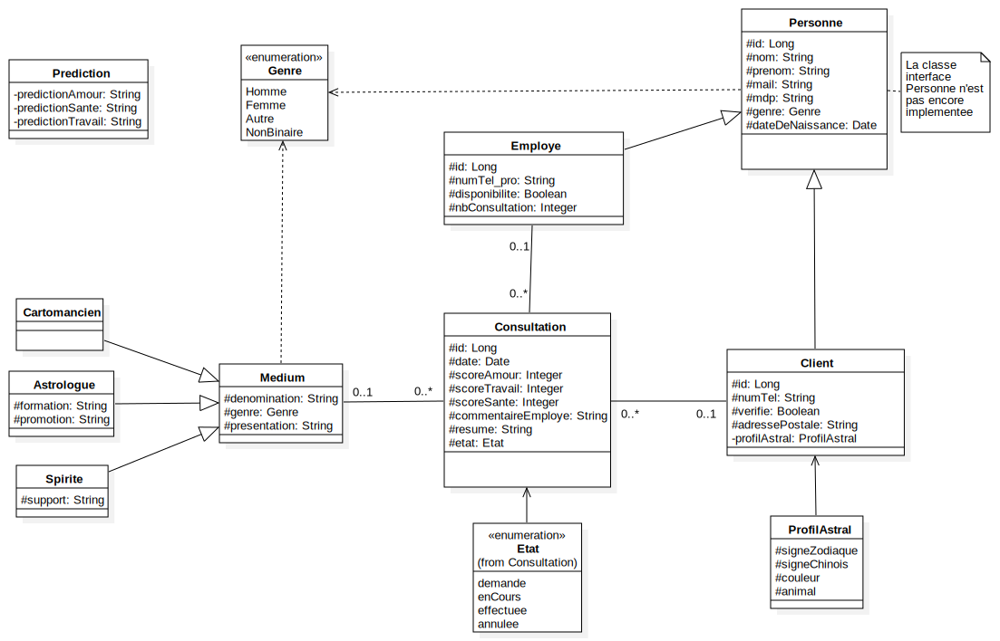
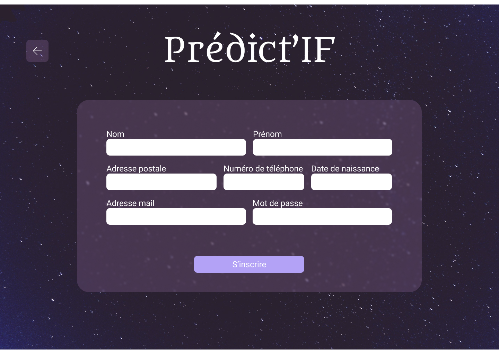
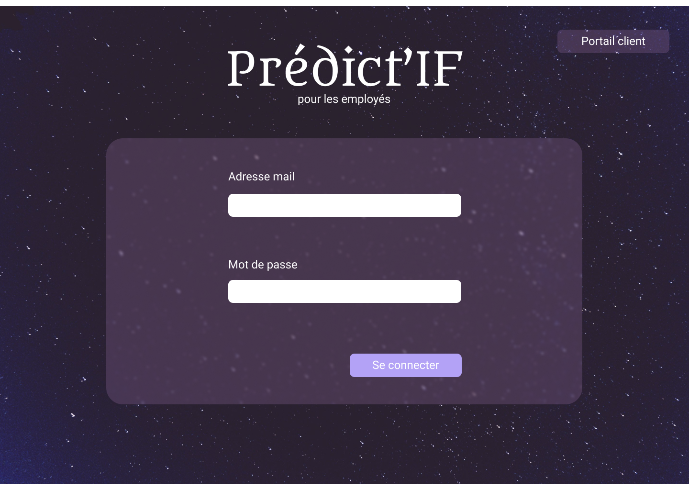
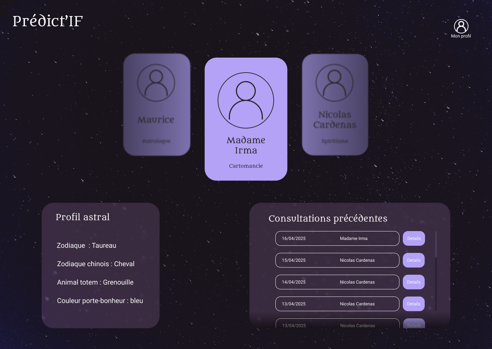
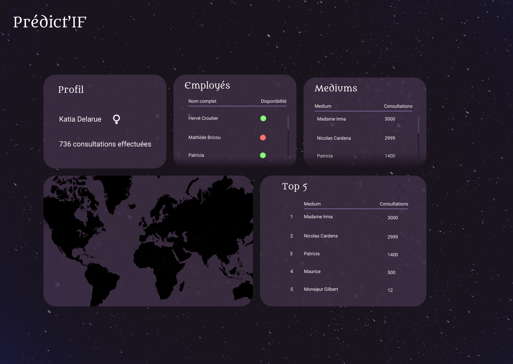
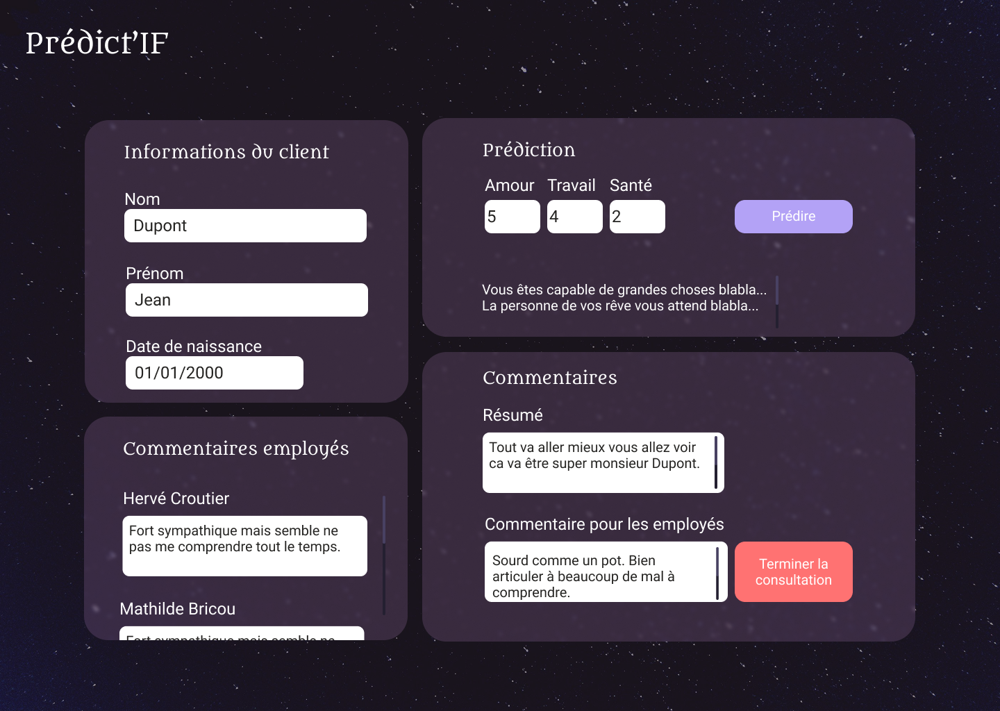
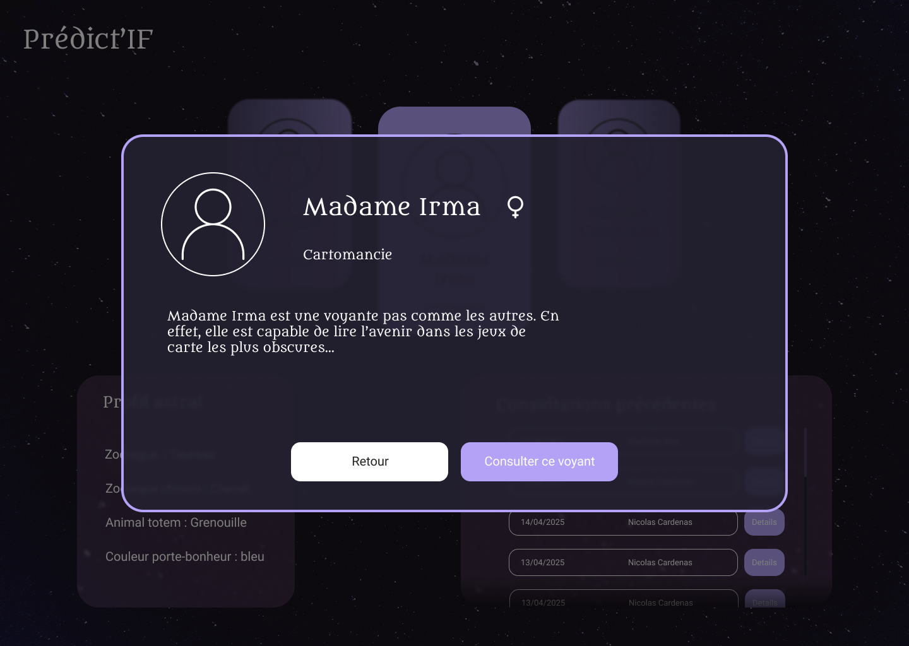

# 📱 Application PREDICT’IF

PREDICT’IF est une solution en ligne qui permet aux particuliers de consulter des médiums par téléphone. L'application gère l'ensemble du parcours utilisateur : de l'inscription à la génération de prédictions personnalisées, en passant par la mise en relation avec un employé incarnant un médium.

Elle propose une expérience utilisateur fluide, automatisée et enrichie par un système de **profil astral personnalisé** via un service externe spécialisé.

---

## ✨ Fonctionnalités principales

- **Création de compte client** via un formulaire en ligne (nom, date de naissance, email, mot de passe, téléphone, etc.)
- **Validation d’inscription par email**, avec envoi d’un message en cas de succès ou d’échec
- **Génération automatique du profil astral** (signe astrologique, signe chinois, couleur porte-bonheur, animal totem) via le service externe **IAstroNet**
- **Demande de consultation** avec possibilité de préciser des préférences (type de médium, genre…)
- **Attribution automatique** d’un médium (employé) disponible, selon les critères exprimés par le client
- **Envoi de notifications** (email ou SMS) aux parties concernées (client et employé)
- **Consultation téléphonique** entre le client et le médium sélectionné
- **Rédaction d’un commentaire post-consultation** par le médium, mis à jour dans le système
- **Génération automatique de prédictions** dans les domaines suivants :
  - 💖 Amour
  - 💼 Travail
  - 🩺 Santé

---

## 🔨 Règles métiers

- Chaque client dispose d’un **identifiant unique basé sur son adresse email**
- Toutes les **informations saisies doivent être valides et cohérentes**
- Un **accusé de réception ou message d’échec** est envoyé pour chaque tentative d’inscription
- L’**attribution d’un médium** respecte à la fois :
  - Sa **disponibilité**
  - Les **préférences exprimées** par le client
  - Un **équilibrage** global des affectations
- Les **demandes de consultation sont traitées en temps réel** (pas de file d’attente ou de planification différée)
- Le service externe **IAstroNet** est utilisé pour :
  - Générer le **profil astral** du client
  - Produire les **prédictions personnalisées**

## Modele du Domaine
 

## Maquettes IHM:

### Page Inscription Client

Ici le client rentrer ses coordonees et s'inscrire

### Page Connection Client

Ici le client se connecte avec son mail et mot de passe

### Page Connection Employe

Meme qu'avant, pour l'employe

### Page Profil Client

Ici le client peut voir ses donnees

### Page Homepage Client

Ici le client peut voir son historique, selectionner un medium, et demander une consultation

### Page Homepage Employe

Ici l'employe peut voir ses stats, 

### Page Consultation

Ici l'employe peut voir les donnes du client et du medium, et faire ses predictions. Il peut terminer la consultation aussi.

### Page Detail Medium

Ici le client peut voir les details du medium

## ⚙️ Services

### 1. `inscrireClient(client: Client): status`  
**Description** : Crée un nouveau compte client avec les informations fournies.

---

### 2. `archiverCompteClient(id: long int): status`  
**Description** : Archive (désactive) un compte client, sans le supprimer de la base. Cette fonction ne sera pas utilisée dans le programme final.

---

### 3. `authentifierEmployé(mail: String, mdp: String): Employé`  
**Description** : Vérifie les identifiants d’un employé et retourne l’objet Employé correspondant s’il existe.

---

### 4. `authentifierClient(mail: String, mdp: String): Client`  
**Description** : Vérifie les identifiants d’un client et retourne l’objet Client s’il est valide et non archivé.

---

### 5. `listerMediums(): List<Medium>`  
**Description** : Retourne la liste de tous les médiums disponibles.

---

### 6. `listerClients(): List<Client>`  
**Description** : Retourne la liste de tous les clients.

---

### 7. `listerEmployes(): List<Employe>`  
**Description** : Retourne la liste de tous les employés.

---

### 8. `historiqueConsultations(idClient: long int): List<Consultation>`  
**Description** : Retourne toutes les consultations effectuées par le client donné.

---

### 9. `creerConsultation(idClient: long int, idMedium: long int): status`  
**Description** : Permet à un client de demander une consultation avec un médium. Le système assigne automatiquement un employé disponible.

**Algorithme (pseudo-code)** :
```pseudo
fonction creerConsultation (idClient : long int, idMedium : long int):
	assigner le client et le medium
	trouver un employé disponible correspondant aux crières de selection <- findSuitableEmploye()
	si pas trouvé : 
		annuler la consultation
	sinon :
		assigner l'employé	
```

---

### 10. `findMedium(idMedium: long int): Medium`  
**Description** : Retourne les détails d’un médium donné (nom, spécialité, description...).

---

### 11. `accepterConsultation(consultation : Consultation): status`  
**Description** : Permet à un employé d’accepter une demande de consultation.

---

### 12. `terminerConsultation(consultation : Consultation, commentaire : String): status`  
**Description** : Termine une consultation (modifie le statut et date de fin).

**Algorithme (pseudo-code)** :
```pseudo
fonction terminerConsultation(consultation : Consultation, commentaire : String)
	ajouter commentaire
	terminer la consulation
	retablir disponibilité employé
```

---

### 13. `genererPredictions(client : Client, scoreAmour: int, scoreTravail: int, scoreSante: int): Prédiction`  
**Description** : Génère une prédiction personnalisée basée sur trois scores en utilisant l'API adéquate.

### 14. `getClientLocalisation(client : client) : LatLng`
**Description** : Utilise l'API GeoNet pour trouver les coordonees du client (Latitude et Longitue).

### 15. `getConsultationsPerMedium() : Map<Long, Integer>`
**Description** : Génère un dictionnaire (map) des mediums avec le nombre de consultations qu'ils ont fait.

### 15. `getTop5SelectedMedium() : Map<Long, Integer>`
**Description** : Génère un dictionnaire (map) des 5 mediums avec le nombre de consultations le plus haut.